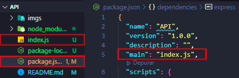
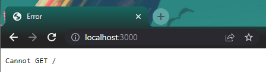
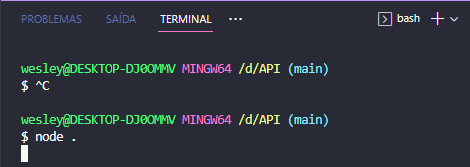
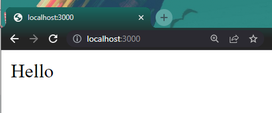
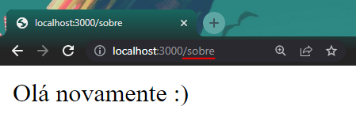
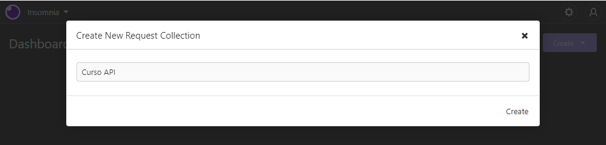
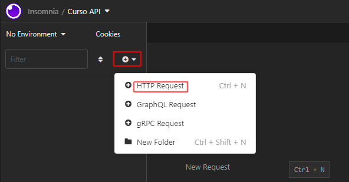
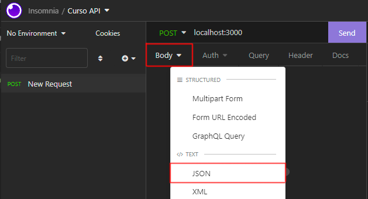

# API com node.js

O objeto deste diretorio é aprender mais sobre os funcionamentos de uma API e sua construção.
O curso será feito pro meio da plataforma rocketseat, na trilha Especializar.

Para este estudo usarei o expresse e o insomnia.

<br>
<br>

# Instalando o Express

Vamos iniciar instalando nosso primeiro **framework**, o seu nome é **"express"** ele é um conjunto de arquivos com codigos que vamos instalar no nosso node, assim poderemos utilizar esses recursos/codigos para usar em nossas aplicações web.

Quando estamos falando de APIs o express tem metodos HTTP que tornam mais rapido e facil criar uma API.

```Bash
npm i express
```

<br>
<br>

# Instalando o insomnia
O navegador só permite que agente faça uso do metodo **```GET```**, quando queresmos fazer uso de outros metodos como o **```POST```** ou **```DELETE```**, o insomnia tem recurso que permitem a gente as requisições através do nosso computador.

<a hrf="https://insomnia.rest/download" style="text-decoration:none; font-size:16px; ">Baixe  o aqui</a>

<br>
<br>


# Iniciando o Express

Vamos começar utilizando a função require para puxar os modulos do express para nosso arquivo.

```JS
const express = require('express')
```

Para inicia-lo criamos uma constante e atribuimos a execução do express a ela, assim poderemos utilizar essas constante para acessar os metodos do express

```JS
const app = express()
```

<br>
<br>

# Iniciando o servidor

**Localhost** se refere ao computador que está executando o programa. 
O computador funciona como se fosse um servidor virtual, e quando queremos abrir esse servidor no navegador nós utilizamos **```localhost:3000```**.

Agora que nós iniciamos o express basta utilizarmos a constante de inicialização **```"app"```** para chamar a função  **```app.listen()```**. 

A função **```listen()```** do Express inicia um socket UNIX e escuta as conexões em um caminho fornecido, o caminho vai ser nossa porta **```3000```**.

```JS
app.listen('3000')
```
As vezes precisaremos parar nosso servidor, quando chegar essa hora basta nos darmos um **```Ctrl + C```** no terminal.
```Bash
Ctrl + C
```

<br>
<br>

# Executando o projeto 
Agora que ja iniciamos o nosso express e criamos nosso servidor local utilizando a porta **```3000```**, nós precisamos executar o nosso projeto, para executa-lo nós digitaremos:
```Bash
node arquivo.js
```

Outra maneira também é usar apenas um **```"node ."```** quando no nosso arquivo **```package.js```** o atributo **```"main"```** está recebendo como valor nosso arquivo **```js```** principal.
```Bash
node .
```



<br>
<br>

# Conectando Rotas
Depois de pesquisar pela url **```localhost:3000```** no navegador e iniciar o nosso servidor, nos será retornado o seguinte erro:


Este erro ocorre por que o navegador só entende a rota **```GET```**,assim o que estiver nessa rota será mostrado no navegador.

Para chamar essa rota nós usamo o metodo **```route()```**, passado como argumento a rota  **```"/"```** que faz referencia a nossa **Url** base. 

```JS
app.route("/").get()
```
<br>
<br>

# Enviando informações com o GET

Agora nós usamos o metodo **GET** nesta rota passando uma função como argumento, e essa função precisa ter 2 parametros --> (req, res)

**req = requisição**

**res = resposta:**

neste caso vamos usar uma arrow function passando esses dois como argumentos, e vamos dentro dessa função executar o codigo que mostra uma mensagem na tela.

para isso nos usamos o parametro res junto com o metodo **send()**.
Basicamente estamos enviando do nosso servidos alguma coisa como respostas para o navegador.

```JS
app.route("/").get((req, res) => res.send("hello"))
```
> Note que quando estamos enviando informações do nosso servidor para o navegador nós utilizamos as palavras "res + send" que significam "Enviar resposta"

  Lenbre-se que para observar a mudança no navegador é necessario parar o servidor usando as teclas **```Ctrl + C```** e depois rodar o nosso servidor novamente.

  
  
  Recarregue o navegador e veja o resultado.

  

Para melhorar ainda o entendomento, vamos criar uma nova rota chamada sobre e passar uma outra mensagem para ela.
```JS
app.route("/sobre").get((req, res) => res.send("Olá novamente :)"))
```
depois disso basta pararmos nosso servidor e depois colocar ele para rodar novamente, em seguida vamos no navegador e colocamos a nossa **```Url```** nova **```localhost:3000/sobre```** . 

  

<br>
<br>

# Recebendo informações com POST
O post permite que com que a gente possa receber informações de fora da nossa API para dentro dela.

Quando vamos receber uma informação de uma rota, nós basicamente passamos o metodo get pra nossa rota, e como argumento para esse **```"POST"```** nós também passamos uma função assim como no **```"GET"```**.

A função também terá os parametros -> (req, res), só que desta vez nós usaremos o **```req.body```** para receber essa requisição.

```JS
app.route("/").post((req, res) => req.body)
```

> Mas quando estamos recebendo informações de fora nós utilizamos as palavras "req + body" que siginifica "corpo da requisição/pedido" 

Para conseguir ver no terminal o que está sendo enviado para nossa API, basta usarmos o **```console.log(req.body)```**
```JS
app.route("/").post((req, res) => console.log(req.body))
```

Agora nós precisaremos usar uma ferramenta chamanda insomnia para enviar dados para nossa API, isso porque o navegador por padrão só acessa a rota **```"GET"```**, ou seja, o navegador não consegue usar nem **```"POST"```** ou **```"DELETE"```**

Com o insomnia aberto, nós vamos em create e fazemos uma nova coleção.



Então criamos uma nova requisição.



Depois mudamos o tipo da rota para **```POST```** e então passamos a **```Url```** que quermos fazer a requisição.


Agora só precisamos passar o conteudo da nossa requisição, para fazer isso nós vamos em body e escolhemos o formato JSON

